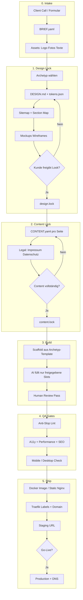

# KMU-Website-Pipeline: Deep Research & Architektur

> Ziel: Eine wiederholbare Pipeline, die lokale Unternehmen-Websites **sauber, markant und deploybar** produziert — klar abgegrenzt von „Vibe Coding“ (Prompt → fertige Seite).

**Referenzseite:** [msb-ai.de](https://msb-ai.de)  
**Repo-Kontext:** SBL-Web (Website-Factory für KMU)

---

## 1. Das Kernproblem: Vibe Coding vs. Factory

### Vibe Coding (was du vermeiden willst)

| Symptom | Folge |
|--------|--------|
| Ein Prompt: „Bau mir eine Handwerker-Website“ | Statistische Mittelwert-Ästhetik |
| Kein festes Briefing, keine Tokens | Jede Seite sieht wie jede andere aus |
| AI schreibt Copy + Layout gleichzeitig | Generische Claims, schwache Lokal-Glaubwürdigkeit |
| Direkt „fertig“ deployen | Kein Review, keine Markenentscheidung, hoher Rework |
| Kein Hosting-Standard | Jede Seite anders deployt, Wartungs-Chaos |

**Vibe Coding** = Modell entscheidet Design, Struktur und Ton. Du bekommst Geschwindigkeit, verlierst Signature und Qualitätssignal.

### Factory-Ansatz (dein Ziel)

```
Mensch entscheidet Rahmen  →  AI füllt innerhalb der Rahmen  →  Mensch prüft Gates  →  Docker deployt
```

Die Pipeline erzwingt **Artefakte vor Code**:

1. Brief (strukturiert)
2. Design-System / Tokens
3. Sitemap + Section-Blueprint
4. Mockup / Wireframe-Freigabe
5. Content-Pack (echte Kundendaten)
6. Build gegen Constraints
7. Anti-Slop-QA
8. Container + Domain

AI bleibt Werkzeug. Die **Entscheidungen** liegen in Dateien, die du kontrollierst.

---

## 2. Was msb-ai.de als Blaupause lehrt

Analyse der öffentlichen Seite (Struktur, nicht Technik-Stack):

### Informationsarchitektur

| Sektion | Job (eine Aufgabe) |
|---------|-------------------|
| Hero | Marke + eine Aussage + ein CTA |
| Region / Kontext | Lokalität (Tübingen–Stuttgart) |
| Prozess-Mini (Eingang → Automation → Mensch prüft) | Vertrauensmechanik in 3 Schritten |
| Erfahrung | Glaubwürdigkeit ohne Fake-„Referenzen“ |
| Schmerzpunkte | Problem-Framing, nicht Feature-Dump |
| Themen / Beispiele | Navigation in Leistungsbereiche |
| Vorgehen | Phasen mit klarem Ergebnis je Phase |
| Team | Menschen hinter dem Angebot |
| Closing CTA | Eine nächste Handlung |

### Design-/Content-Muster, die für KMU skalieren

1. **Eine Composition im First Viewport** — keine Stats-Leiste, keine Promo-Chips, kein Dashboard-Feeling.
2. **Klarer Claim, lokaler Anker** — „Region …“ statt generischem SaaS-Speak.
3. **Phasen mit Ergebnis** — jedes Modul liefert etwas Messbares (entscheidungsfähig).
4. **Ehrliche Social Proof** — Erfahrungshintergrund statt erfundener Logos.
5. **Eine Conversion** — „Prozess prüfen lassen“, nicht fünf konkurrierende CTAs.
6. **Unterseiten spiegeln dasselbe Gerüst** — z. B. `/vorgehen` wiederholt die Phasen-Logik vertieft.

### Ableitung für die Factory

MSB ist kein Template zum Klonen — es ist ein **Archetyp**:

- `service-local-b2b` (Beratung / Dienstleistung, lokal, Lead-Form)
- Alternativen später: `handwerk-local`, `gastro-local`, `praxis-local`, `retail-local`

Jeder Archetyp definiert erlaubte Sektionen, verbotene Patterns und Pflicht-Content-Felder.

---

## 3. Anti-AI-Slop: Forschungsstand (2025–2026)

Quellen u. a.: Sailop Anti-AI Design Guides, 925 Studios, Design-Guard/Stitch-Forge-Ansätze, Agency-Engine-Plan-Packages.

### Die 7 Dimensionen generischer AI-Sites

1. **Farbe** — Blau–Lila-Gradienten, Hue ~200–290°, Tailwind `gray-50`
2. **Typo** — Inter / system-ui / Poppins als einzige Face, starre Type-Scale
3. **Layout** — Hero → 3 Cards → Testimonials → Pricing → CTA, immer `max-w-7xl`
4. **Motion** — Fade-up on scroll überall, Hover-Scale + Shadow
5. **Komponenten** — Icon+Title+Text-Cards, Badge+H1+Sub+2 Buttons im Hero
6. **Spacing** — überall dieselben `py-24` / `gap-8`
7. **Craft** — kein `::selection`, kein `prefers-reduced-motion`, Default-Focus

### Harte Factory-Regeln (nicht optional)

```yaml
anti_slop:
  fonts_forbidden: [Inter, Roboto, Arial, Poppins, system-ui-only]
  hue_band_forbidden: [200, 290]   # primary accent outside this
  hero_forbidden:
    - floating_badges
    - stat_strips
    - three_feature_cards_in_hero
    - inset_rounded_hero_image
  layout_forbidden:
    - default_three_equal_cards_as_only_pattern
  motion:
    hero_entrance: none
    fade_up_everywhere: false
    require_reduced_motion: true
  copy_forbidden:
    - "Unlock the power of"
    - "Seamless experience"
    - "Cutting-edge"
    - "Next-level"
    - "Revolutionize your"
  imagery:
    stock_only: false
    prefer: real_photos | location | product | team
```

### Warum Constraints vor Prompts kommen

Ohne Design-System regeneriert der Agent beim nächsten Component wieder Defaults.  
**Procedural prevention** schlägt **manuelles Aufräumen**:

1. `DESIGN.md` / Tokens erzeugen (Palette außerhalb AI-Hue, Font-Pairing, Section-Archetypen)
2. Agent nur gegen diese Dateien bauen lassen
3. CI-Lint / Checklist als Gate (Slop-Score-Ziel: &lt; 30–50)

---

## 4. Empfohlene End-to-End-Pipeline



### Phase 0 — Intake (30–60 Min)

**Output:** `clients/<slug>/BRIEF.yaml` + Asset-Ordner

Pflichtfelder (Minimum Viable Brief):

- Firma, Ort, PLZ, Branche, Zielgruppe
- Ein Primärziel der Website (Leads / Anruf / Termin / Besuch)
- USP in einem Satz (Mensch formuliert, AI darf nur kürzen)
- Konkurrenten (2–3 URLs) + „so sollen wir *nicht* aussehen“
- Pflichtseiten, Sprachen, Legal-Daten
- Bildmaterial-Status (vorhanden / Shoot nötig / Platzhalter-Policy)

→ Schema: [`docs/schemas/brief.schema.json`](../schemas/brief.schema.json)  
→ Template: [`templates/client-brief/BRIEF.example.yaml`](../../templates/client-brief/BRIEF.example.yaml)

### Phase 1 — Design Lock (bevor Code)

**Output:** `DESIGN.md`, `tokens.json`, Mockups, `design.lock`

Schritte:

1. **Archetyp** wählen (`service-local-b2b`, …)
2. **Mood** festnageln (3 Referenzbilder, 1 Satz „Atmosphäre“)
3. **Tokens** generieren:
   - Primary Hue außerhalb 200–290°
   - Display + Body Font (expressiv, nicht Inter)
   - Spacing-Rhythmik mit bewusster Variation
4. **Section Map** (welche Sektionen in welcher Reihenfolge — max. eine Aufgabe je Sektion)
5. **Mockups**: Low-Fi Wireframe → Hi-Fi 1 Desktop + 1 Mobile für Home (+ 1 Unterseite)
6. **Kundenfreigabe** = `design.lock` (Commit-Hash / Datum / Freigeber)

Tools-Optionen:

| Ansatz | Wann |
|--------|------|
| Figma / Penpot manuell | Premium, visuelle Kontrolle |
| Stitch / Design-Guard-ähnliche CLI | Schnelle Screen-Generierung *gegen* DESIGN.md |
| HTML-Wireframe im Repo | Kein Figma nötig, reviewbar in PR |

**Regel:** Kein Produktions-Code vor `design.lock`.

### Phase 2 — Content Lock

**Output:** `CONTENT.yaml`, Legal-Texte, `content.lock`

- Alle Headlines, Absätze, CTAs, Meta-Titles in strukturierter Datei
- AI darf **Vorschläge** machen; finale Texte brauchen menschliche Freigabe (besonders Claims, Preise, Garantien)
- Lokale Spezifika erzwingen: Stadtteil, Einzugsgebiet, Öffnungszeiten, echte Telefonnummer
- Keine Stock-Portrait-„Teams“, wenn es kein Team-Foto gibt → ehrliche Alternative (wie MSB: Erfahrung statt Fake-Logos)

### Phase 3 — Build

**Stack-Empfehlung für KMU-Factory:**

| Option | Pro | Contra |
|--------|-----|--------|
| **Astro** (static) | Schnell, simpel, günstig hostbar | Weniger „App“-Feeling |
| Next.js (SSG) | Ökosystem, Forms/API | Schwerer als nötig für Visitenkarten-Sites |
| Static HTML + Tailwind | Maximal simpel | Weniger DX bei vielen Sites |

**Empfehlung Start:** Astro + geteilte Component-Library + Archetyp-Templates.

Build-Flow:

```
template/<archetype>/
  + tokens.json
  + CONTENT.yaml
  + assets/
  → AI/Agent implementiert nur erlaubte Variationen
  → Output: dist/ oder Container
```

Agent-Instructions (im Repo):

- `AGENTS.md` / `DESIGN.md` sind Source of Truth
- Verbotene Patterns explizit listen
- „Wenn unsicher → Token/Brief fragen, nicht erfinden“

### Phase 4 — QA Gates (automatisch + manuell)

| Gate | Check |
|------|--------|
| Anti-Slop | Fonts, Hue, Hero-Budget, Card-Spam, Copy-Banlist |
| **Launch Checklist (20)** | 404, CTA, Danke, FAQ, robots, Titles/Meta, OG, Maps, Schema, Sticky CTA, Analytics-Consent, … — siehe [`launch-checklist.md`](./launch-checklist.md) und [`INTAKE-QUESTIONS.md`](../../templates/client-brief/INTAKE-QUESTIONS.md) |
| Content | Keine Platzhalter (`Lorem`, `Firma XY`) |
| A11y | Kontrast, Fokus, Alt-Texte, Reduced Motion |
| Perf | LCP-Bilder, Fonts subset, kein unnötiges JS |
| SEO | Title/Description, OG, Sitemap, Schema.org LocalBusiness |
| Legal | Impressum/Datenschutz vorhanden und verlinkt |
| Visual | Desktop + Mobile Screenshot-Diff gegen Mockup |

**Intake:** Die 20 Launch-Aspekte werden als Fragen im Brief (`launch:`) erfasst — nicht erst beim Go-Live improvisiert.  
**Legal DE:** Branchen-Research + Intake unter [`legal-de-branchen.md`](./legal-de-branchen.md) und [`LEGAL-INTAKE.md`](../../templates/client-brief/LEGAL-INTAKE.md) (DDG, TDDDG, HWG, BFSG, …). Kein Rechtsrat.

**Pflichtfragen (ein Fragebogen → BRIEF → Docker):** [`pflichtfragen-katalog.md`](./pflichtfragen-katalog.md) · YAML [`pflichtfragen.catalog.yaml`](./pflichtfragen.catalog.yaml) · Schema [`questionnaire.schema.json`](../schemas/questionnaire.schema.json).

### Phase 5 — Docker Hosting

Ziel: Viele Kunden-Sites auf **einem Server**, isoliert, mit eigener Domain.

```
Internet
   │
   ▼
Traefik / Caddy  (TLS, Routing)
   │
   ├── client-a-nginx   ← static dist
   ├── client-b-nginx
   └── client-c-astro-node  (nur wenn SSR nötig)
```

**Standard für 90 % der KMU-Sites:** Multi-Stage Build → Nginx Alpine mit `dist/`.

 pro Client:

- eigener Compose-Stack oder Label-Set
- Resource Limits (CPU/RAM)
- Healthcheck
- Staging-Subdomain `slug.staging.yourfactory.de`
- Production: Kundendomain via DNS A/CNAME + On-Demand TLS

Skizze: [`infra/docker-sketch/`](../../infra/docker-sketch/)

---

## 5. Repo-Layout (Website Factory)

```
sbl-web/
├── docs/
│   ├── research/                 # diese Research
│   └── schemas/                  # JSON Schemas für Brief/Content/Design
├── archetypes/
│   ├── service-local-b2b/        # inspiriert von msb-ai.de
│   ├── handwerk-local/
│   └── ...
├── packages/
│   ├── ui/                       # shared primitives (nicht generische Card-Farm)
│   ├── anti-slop/                # lint rules
│   └── content-schema/
├── clients/
│   └── msb-ai/                   # Beispiel / echte Kunden
│       ├── BRIEF.yaml
│       ├── DESIGN.md
│       ├── tokens.json
│       ├── CONTENT.yaml
│       ├── mockups/
│       ├── site/                 # Astro/Next project
│       └── docker-compose.yml
├── infra/
│   ├── traefik/
│   ├── scripts/new-client.sh
│   └── docker-sketch/
├── templates/
│   └── client-brief/
└── AGENTS.md                     # Regeln für Coding-Agents
```

---

## 6. Der „Happy Path“ für eine neue Website

1. `./infra/scripts/new-client.sh baeckerei-mueller`
2. Brief ausfüllen (Call + Formular)
3. Archetyp + Tokens vorschlagen (Agent), Mensch locked Design
4. Mockups freigeben
5. Content-Pack ausfüllen / freigeben
6. `pnpm --filter clients/baeckerei-mueller build`
7. Anti-Slop + Lighthouse CI
8. `docker compose up` → Staging-URL
9. Kunde prüft Staging
10. DNS umstellen → Production Labels

**Zeitersparnis** kommt nicht vom Überspringen von Design, sondern vom **Wiederverwenden von Archetypen + Gates**.

---

## 7. Mockups: wie wenig reicht?

Für KMU reicht oft:

| Artefakt | Umfang |
|----------|--------|
| Sitemap | 1 Seite Text |
| Wireframe Home | Sektionsblöcke benannt |
| Hi-Fi Home | Desktop + Mobile |
| Hi-Fi 1 Innen | z. B. Leistungen oder Kontakt |
| Component Notes | Buttons, Formular, Footer |

Nicht nötig am Anfang: vollständige Design-System-Bibliothek mit 40 Components.

**Gate:** Kunde sagt „so soll es wirken“ *bevor* der Agent 12 Sektionen Code schreibt.

---

## 8. Rollenverteilung: Mensch vs. AI

| Aufgabe | Mensch | AI |
|---------|--------|-----|
| Geschäftsverständnis / USP | ✓ | assistiert |
| Design-Richtung / Freigabe | ✓ | Vorschläge |
| Tokens außerhalb Slop-Band | entscheidet | generiert Optionen |
| Copy Claims / Rechtliches | ✓ final | Entwürfe |
| Boilerplate Layout-Code | review | ✓ schreibt |
| Anti-Slop Fixes | Spot-Check | ✓ automatisiert |
| Deploy / DNS | ✓ / Script | Script |

---

## 9. Abgrenzung zu bestehenden Produkten

| Produkt / Muster | Nutzen für dich | Limit |
|------------------|-----------------|-------|
| Agency Engine | Brief → Plan Package für Agents | Hosting/Docker nicht Kern |
| Design Guard / Stitch Forge | DESIGN.md → Screens → Lint → Build | Früh / CLI-lastig |
| Sailop | Slop-Detection & Design-System-Gen | Externes Produkt |
| Lovable / v0 / Bolt | Schnelle UI | Genau das Vibe-Coding-Problem |
| FactoryJet-ähnlich | Figma-first Agency Process | Menschlich teuer, langsam skalierbar |

**Dein Moat:** Eigene Archetypen + Anti-Slop-Gates + Docker-Multi-Site-Betrieb für DE/AT/CH-KMU (Impressum, lokale Glaubwürdigkeit, Deutsch-Ton).

---

## 10. MVP-Roadmap (technisch, ohne Kalender-Schätzung)

### MVP 0 — Dokumentation & Schemas *(dieser Stand)*
- Research, Brief-Schema, Docker-Skizze, MSB-Referenz-Mapping

### MVP 1 — Ein Archetyp end-to-end
- `service-local-b2b` Template (Astro)
- BRIEF → tokens → CONTENT → Build
- Anti-Slop Checklist als Script
- Ein Demo-Client (anonymisiert oder MSB-ähnlich)

### MVP 2 — Hosting
- Traefik + `new-client.sh`
- Staging-Subdomains
- Backup + Resource Limits

### MVP 3 — Intake UX
- Formular / Notion / Sheet → BRIEF.yaml
- Optional: Call-Transcript → Brief-Draft (mit Human Edit)

### MVP 4 — Visual Pipeline
- Mockup-Export (Figma oder HTML)
- Screenshot-Compare in CI

### MVP 5 — Mehr Archetypen
- Handwerk, Gastronomie, Praxis — jeweils eigene Section-Maps und Ton-Regeln

---

## 11. Konkrete nächste Bau-Schritte

1. `BRIEF.yaml` + Schema finalisieren und an 2 echten KMU-Beispielen testen  
2. `DESIGN.md`-Template mit Anti-Slop-Defaults schreiben  
3. Astro-Archetyp `service-local-b2b` scaffolden (an MSB-IA angelehnt, nicht 1:1 Kopie)  
4. `anti-slop` Lint (Fonts, Hue, Banlist, Hero-Budget)  
5. Traefik + Nginx-Client-Template auf dem Server  
6. Erst danach: Automation/Agents tiefer verdrahten  

---

## 12. Kurzfazit

Die Pipeline ist **kein** „besserer Prompt“. Sie ist ein **Locked-Artifact-Workflow**:

> Brief → Design Lock → Content Lock → Constrained Build → QA → Docker Ship

msb-ai.de zeigt die qualitative Zielrichtung: lokale Klarheit, eine Composition, Phasen mit Ergebnis, ehrlicher Proof, ein CTA.  
Anti-Slop-Research zeigt: ohne Tokens und Gates driftet jeder Agent zurück in den Mittelwert.

Wenn du das umsetzt, unterscheidest du dich nicht durch „auch AI“, sondern durch **wiederholbare Handwerklichkeit mit AI-Beschleunigung**.
